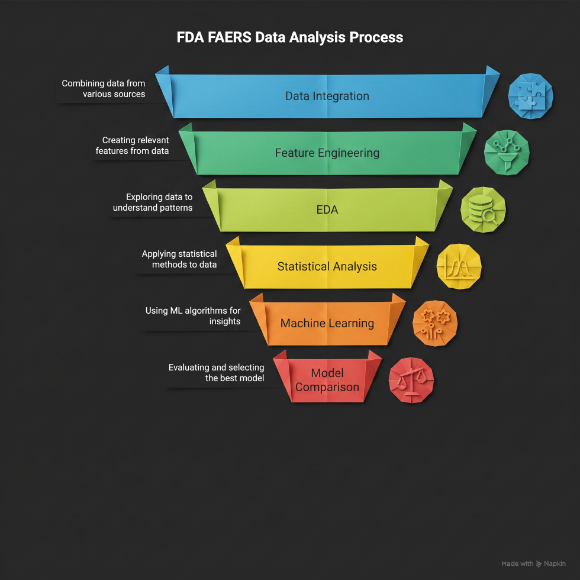

# FDA FAERS Safety Analytics

### End-to-End Machine Learning Pipeline for Pharmacovigilance

---

FAERS Safety Analytics is an end-to-end machine learning project that predicts whether an FDA adverse drug event report is classified as **serious**.

The workflow combines **relational data integration, feature engineering, EDA, statistical testing, supervised learning, K-Means clustering, and Streamlit-based model inference**.

---

---

<table>
<tr>

<td width="50%" valign="top">

### Dataset

| Item | Value |
|---|---:|
| Source | FDA FAERS |
| Reports | **406,184** |
| Predictors | **49** |
| Target | Serious vs Non-serious |
| Models | **9** |
| K-Means Clusters | **7** |

</td>

<td width="50%" valign="top">

### Best Model

| Metric | Value |
|---|---:|
| Model | **Random Forest ⭐** |
| Accuracy | **92.6%** |
| ROC-AUC | **0.968** |
| F1 Score | **0.932** |
| CV Accuracy | **92.4%** |

</td>

</tr>
</table>

---

<table>
<tr>

<td width="50%" valign="top">

### Models Evaluated

- Logistic Regression
- LDA / QDA
- Gaussian Naive Bayes
- K-Nearest Neighbors
- Decision Tree
- **Random Forest ⭐**
- Support Vector Machine
- Neural Network (MLP)

</td>

<td width="50%" valign="top">

### Technologies

</td>

</tr>
</table>

---

<table>
<tr>

<td width="50%" valign="top">

---

<table>
<tr>

<td width="33%" valign="top">

The application provides:

- Exploratory Data Analysis
- Statistical Analysis
- Machine Learning Results
- Clustering Analysis
- Serious Event Prediction

> 🚀 **Live deployment coming soon**

</td>

<td width="33%" valign="top">

<pre>
FAERS-Safety-Analytics/
├── app.py
├── assets/
├── data/
├── models/
├── notebooks/
├── pages/
├── utils/
└── requirements.txt
</pre>

</td>

<td width="34%" valign="top">

<pre>
git clone
https://github.com/
marufasumi/
FAERS-Safety-Analytics.git

cd FAERS-Safety-Analytics

pip install -r
requirements.txt

streamlit run app.py
</pre>

</td>

</tr>
</table>

---

---

This project is intended for portfolio and educational purposes only. Model predictions should **not** be used for clinical decision-making.

---

**Marufa Sultana Sumi**

---

<b>Data Source:</b> FDA Adverse Event Reporting System (FAERS) • <b>License:</b> MIT

